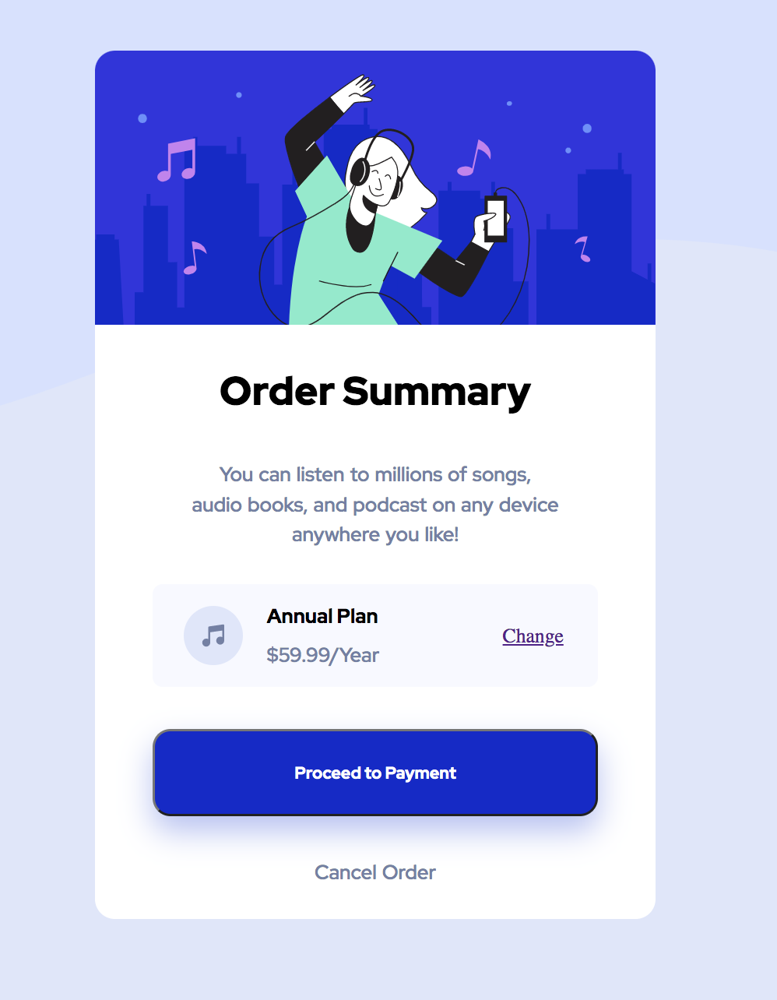

# Frontend Mentor - Order summary card solution

## Table of contents

- [Overview](#overview)
  - [The challenge](#the-challenge)
  - [Screenshot](#screenshot)
  - [Links](#links)
- [My process](#my-process)
  - [Built with](#built-with)
  - [What I learned](#what-i-learned)
  - [Continued development](#continued-development)
  - [Useful resources](#useful-resources)
- [Author](#author)
- [Acknowledgments](#acknowledgments)

## Overview

### The challenge

Users should be able to:

- See hover states for interactive elements
- Responsive design from desktop to mobile

### Screenshot

### Links

- Solution URL: (https://github.com/rrebolledo90/order-summary.git)
- Live Site URL: (https://rrebolledo90.github.io/order-summary/)

## My process

### Built with

- Semantic HTML5 markup
- CSS custom properties
- Flexbox
- Figma

### What I learned

This was a fun project, things I learned included how to set a hover state to a button,
how to set background images relative to the body, and shadowing. Everything was done with Flexbox,
I am starting to get a better hang of layouts.

### Continued development

Need to work more on understanding relative units better, such as vh, em, rem, etc. and when to use one over the other.

### Useful resources

Hex color Codes @color-hex.org
and Box shadow rgba @developer.mozilla.org
stackoverflow
